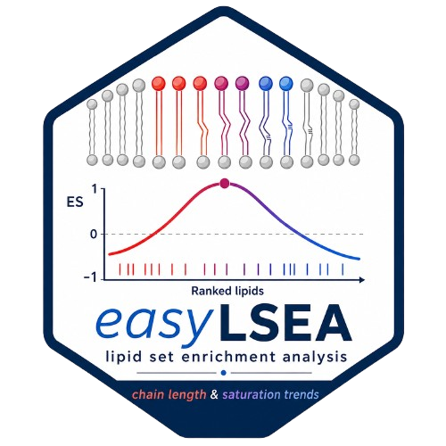

# easyLSEA 



<!-- badges: start -->
[](https://github.com/DavidGO464/easyLSEA/actions/workflows/R-CMD-check.yaml)
[](https://opensource.org/licenses/MIT)
 
[](https://doi.org/10.5281/zenodo.20341372)

<!-- badges: end -->

**easyLSEA** is an R package for biology-aware **Lipid Set Enrichment
Analysis (LSEA)** designed for untargeted lipidomics data. It provides a
dual-engine framework (Kolmogorov-Smirnov + fgsea) for testing whether
lipid classes, LIPID MAPS categories, and functional categories are
coordinately shifted between experimental groups, alongside a dedicated
fatty acid chain analysis module.

---

## Key features

- **Dual-engine enrichment** -- KS-based LSEA and fgsea run in parallel;
  a Convergence column flags sets significant in both.
- **Biology-aware annotation** -- hierarchical prefix matching covering
  all major lipid classes (GPL, SL, GL, FA, ST, acylcarnitines, oxylipins,
  bile acids), validated against real VLDL lipidomics data.
- **Chain analysis** -- class-aware parsing of sn-2 (PC, PE), N-acyl (SM,
  Cer, HexCer), long-format (TG, PI), and single-chain (LPC, LPE, CAR)
  species with tile and trend plots.
- **Three analysis levels** -- LipidClass, LipidCategory_LMAPS, and
  LipidCategory_functional tested simultaneously.
- **Flexible export** -- CSV tables, multi-sheet Excel workbook, PDF/PNG
  plots, and a standalone HTML report via a single `export_lsea()` call.
- **Reproducible** -- `withr::with_seed()` for RNG isolation; all
  parameters exposed as arguments with documented defaults.

---

## Installation

```r
# Install from GitHub
# install.packages("remotes")
remotes::install_github("DavidGO464/easyLSEA")
```

For the fgsea engine (optional but recommended):

```r
# install.packages("BiocManager")
BiocManager::install("fgsea")
```

---

## Quick start

```r
library(easyLSEA)

# Load the built-in example dataset
data("lipid_example")

# Run the full pipeline in one call
result <- easyLSEA(
  data      = lipid_example,
  lipid_col = "LipidName",
  fc_col    = "logFC",
  case_lbl  = "NASH",
  ref_lbl   = "Control",
  engine    = "ks"          # or "fgsea" or "both"
)

# Inspect results
print(result)
summary(result)

# Access individual tables
head(result$lsea$ks)         # KS enrichment table
head(result$chains$parsed)   # parsed chain observations

# Export everything
export_lsea(result, dir = "results/", format = c("csv", "excel", "pdf"))
```

---

## Workflow

```
Raw lipidomics data (data.frame)
        |
        v
annotate_lipids()          -- assign LipidClass, LipidCategory
        |
        +--------> run_lsea()            -- KS + fgsea enrichment
        |                |
        |                +--> plot_lsea()
        |
        +--------> parse_lipid_chains()  -- chain length & unsaturation
                         |
                         +--> plot_chains()
        |
        v
export_lsea()              -- CSV / Excel / PDF / HTML
```

Or use the one-call wrapper:

```r
result <- easyLSEA(data, ...)   # runs all of the above
```

---

## Modular use

Each step can be run independently:

```r
# Step 1 -- annotate
annotated <- annotate_lipids(data, lipid_col = "LipidName")

# Step 2 -- enrichment only
lsea_out <- run_lsea(
  data       = annotated,
  fc_col     = "logFC",
  engine     = "both",
  case_lbl   = "NASH",
  ref_lbl    = "Control"
)

# Step 3 -- chain analysis only
chains_out <- parse_lipid_chains(annotated)
chain_plots <- plot_chains(chains_out, case_lbl = "NASH", ref_lbl = "Control")

# Step 4 -- export
export_lsea(lsea_out, format = c("csv", "excel"))
```

---

## Lipid class coverage

Classes follow [LIPID MAPS](https://www.lipidmaps.org) shorthand nomenclature.

| Category | Classes |
|---|---|
| Glycerophospholipids | PC, PE, PI, PS, PG, PA, CL, LPC, LPE, LPI, LPG, LPA, LPS |
| Ether-GPL | PC O, PE O, PS O, PG O, TG O, DG O |
| Sphingolipids | SM, Cer, HexCer, GlcCer, Hex2Cer, Hex3Cer, SHexCer, CerPE, PE-Cer |
| Glycerolipids | TG, DG, MG |
| Fatty Acyls | FFA, FA, FAHFA |
| Acylcarnitines | CAR |
| Sterol Lipids | CE, FC, ST |
| Bile Acids | CA, CDCA, DCA, LCA, GCA, TCA, GCDCA, TCDCA |
| Glycolipids | DGDG, MGDG |
| Other | CoQ, Unknown (fallback) |

> **Oxylipins** are not a formal LIPID MAPS category; oxidized fatty acid species (e.g. HETE, HODE, PGE2) are classified as Fatty Acyls and handled at class-level LSEA only.

---

## Chain analysis framework

The strategy applied to each lipid class depends on its biological structure and the annotation resolution available in the dataset. When individual chains are not resolved, all classes fall back to class-level LSEA.

| Strategy | Classes | Rationale |
|---|---|---|
| **sn-2 chain** | PC, PE, PE O | sn-1 position is typically conserved; biological variability resides in sn-2 |
| **N-acyl chain** | SM, Cer, HexCer, GlcCer, Hex2Cer, Hex3Cer | sphingoid base (d18:1) is conserved; the N-acyl chain drives class diversity |
| **Long format** | TG, DG, PI, PS, PG, PA, CL | all acyl chains are biologically variable; each resolved chain is analysed as an independent observation |
| **Single chain** | LPC, LPE, LPI, LPG, LPA, LPS, CAR, FFA, CE | one acyl chain per species by definition |
| **Class-level LSEA only** | FC, ST, CoQ, BA, FAHFA, Oxylipin | no acyl chain or structure too complex for chain-level inference |
---

## Citation

If you use easyLSEA in your research, please cite:

> Guardamino Ojeda D, et al. (2026). *easyLSEA: biology-aware lipid set
> enrichment analysis with dual KS and fgsea engines*. GitHub:
> https://github.com/DavidGO464/easyLSEA.
> DOI: https://doi.org/10.5281/zenodo.20341372

---

## Optional dependencies

| Package | Purpose | Install |
|---|---|---|
| `fgsea` | fgsea engine | `BiocManager::install("fgsea")` |
| `lipidAnnotator` | Enhanced annotation | `remotes::install_github(...)` |
| `openxlsx` | Excel export | `install.packages("openxlsx")` |
| `rmarkdown` | HTML report | `install.packages("rmarkdown")` |

---

## License

MIT -- see [LICENSE](LICENSE) for details.
